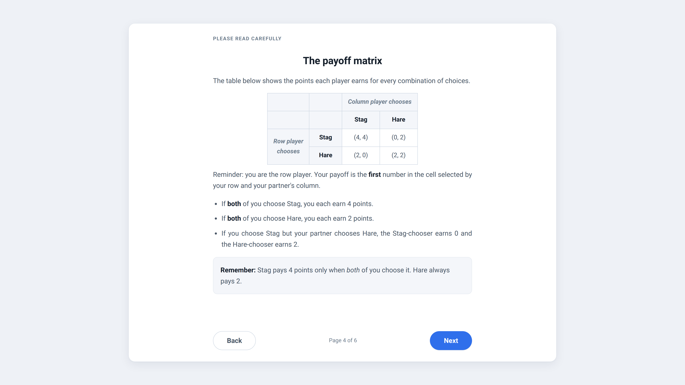
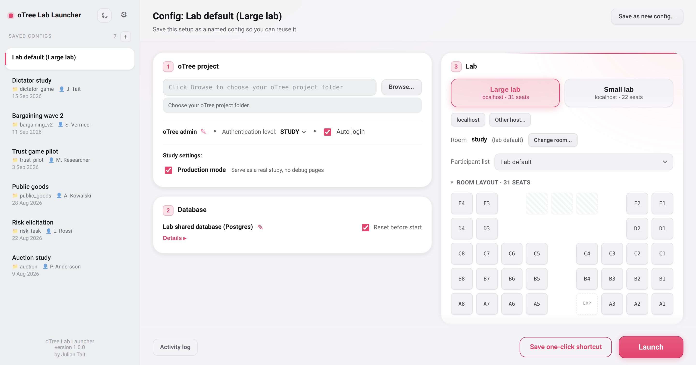
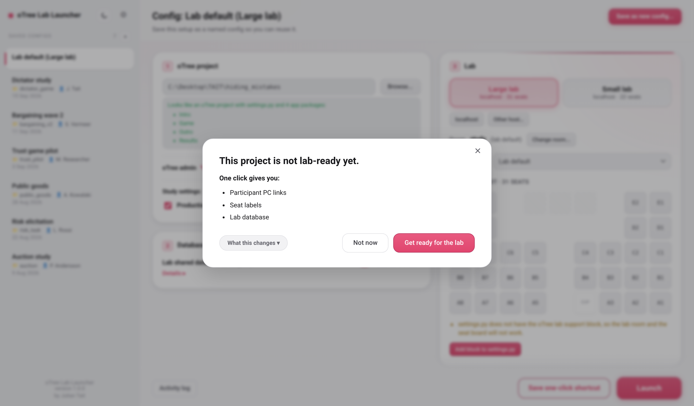
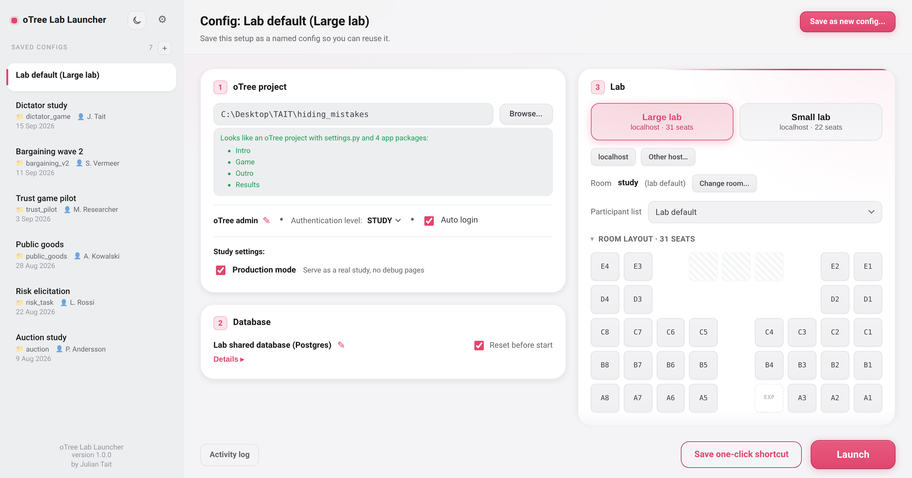
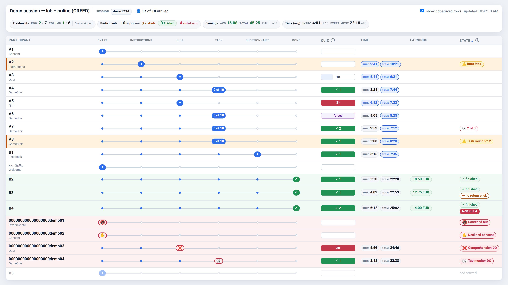

# oTree Lab Launcher: user guide

## 1. Introduction

The oTree Lab Launcher takes a working oTree experiment and makes it run in your
lab in a few clicks. You point it at your project folder and it wires up the
database, the per-seat participant links, and the experiment room, then starts
the oTree server ready for participants to sit down and begin.

It runs as a desktop app that opens in your default browser (there is also a
simple native-window version). Two people use it: a **lab manager** who sets the
machine up once, and **experimenters** who then launch their own studies without
touching any of that setup.

## 2. Usage

### Part 1 — Lab manager (one-time setup)

The lab manager looks after the machine that runs sessions. This is a one-time
job. Once it is done, experimenters never repeat any of it: they open the
launcher, point it at their project, and launch.

The first time the launcher runs on a machine (when there is no
`data/lab_info.json` yet) it opens a **setup wizard** on its own. In the wizard
you:

- Add your lab or labs: a name, the host address of the machine that runs
  sessions, and the seat list.
- Optionally set up a shared Postgres database and the Postgres admin username
  and password (see the tiers below).

Your labs, hosts, seat lists, and room-map references are saved to
`data/lab_info.json` (`data/lab_info.example.json` shows the shape). You rarely
need to hand-edit that file, because hosts, passwords, and databases are all
editable later from inside the app under **gear -> Lab Settings**. Room layouts
(the top-down seat maps the launcher draws) live in `data/maps/`; each lab points
at a map by name, and `data/maps/README.md` explains how to add your own.

**What depends on the setup: three tiers**

Which features are available to experimenters depends on how far the lab manager
takes the setup.

1. **SQLite — always works, zero setup.** oTree's built-in SQLite database needs
   no configuration at all. It is the option that always works out of the box,
   and the whole session runs on the local machine. Any experimenter can use it
   with nothing set up by the lab manager. In the app it is the
   **"No lab database (oTree SQLite)"** option. If you do nothing else, this
   still works.

2. **Postgres — for a shared or custom database.** To offer a shared default
   database that every experimenter can pick in one click, and/or to let
   experimenters point at their own custom Postgres databases, the lab manager
   must install and set up PostgreSQL on the machine and enter the **Postgres
   admin username and password** in the setup wizard. With that done, the wizard
   can create the shared "easy-use" database, and the in-app buttons let anyone
   create their own database later, so you do not have to make one per study.
   (Creating a database from the app also needs `psycopg2`:
   `pip install psycopg2-binary`.)

3. **GitHub workspaces (Organisation Sync) — for pulling experiment folders from
   your lab's GitHub organisation.** This is optional and **off by default**. To
   let experimenters clone and update experiment repos straight from your lab's
   GitHub organisation (no terminal), the lab manager must:
   - Create a GitHub organisation for the lab. See GitHub's own guide:
     <https://docs.github.com/en/organizations/collaborating-with-groups-in-organizations/creating-a-new-organization-from-scratch>
   - Sign each lab experimenter PC into that organisation with a **read-only
     credential** stored once on the machine. Use a fine-grained personal access
     token scoped to read-only. GitHub's own guide covers creating and scoping
     tokens (including fine-grained tokens):
     <https://docs.github.com/en/authentication/keeping-your-account-and-data-secure/managing-your-personal-access-tokens>

   The credential can be as broad as the whole lab or as fine-grained as
   per-PC. **The launcher never stores or handles any token itself** — it relies
   entirely on the git credential already on the machine. If that is not set up,
   leave the feature off.

   Turn it on under **gear -> Lab Settings -> GitHub Organisation Sync**: a tick
   box shows or hides the GitHub buttons, and a field sets the organisation name
   (so the clone target is `<org>/<repo>` and is not hardcoded). Both settings
   are saved on this computer. When it is on, experimenters get a **GitHub**
   button next to Browse (clones a named repo and auto-selects it) and a
   per-config **Git Pull** button (runs `git pull` in the selected study folder,
   never the launcher's own folder).

**The per-seat links (the important part)**

Each lab PC opens its own fixed link:

```
http://HOST:8000/room/study?participant_label=SEAT&welcome_page_ok=1
```

- `HOST` is the machine that runs the session (the one running the launcher).
- `study` is the room.
- `SEAT` is that computer's seat label.
- `welcome_page_ok=1` skips oTree 6's Welcome/Start page, so the seat auto-admits
  with no click.

**This exact URL (with `welcome_page_ok=1`) is the link to put in all lab
documentation and on the lab computers.** Without the flag, oTree 6 first shows a
Welcome page that needs a click. Set each machine's link once — as the browser
homepage or a bookmark, one seat per machine — and you never touch it again. The
link is always active; before the room session exists it shows a wait page that
advances on its own the moment the session opens. When a participant opens their
link, that seat flips from grey to green on the experimenter's monitor, which is
how the consistent links track who's who.

**Room warning.** The desktop shortcuts point at the `study` room. If a study
uses a different room, its links must point at that room instead:

```
http://HOST:8000/room/THEIRROOM?participant_label=SEAT&welcome_page_ok=1
```

The launch confirmation screen warns about this whenever the chosen room is not
`study`, and shows the correct link to use.

**Saving configs.** You can save a config per study. A saved config relaunches
that study in one click in later sessions, so common studies are always a
double-click away.

### Part 2 — Experimenter (usage)

Three things, in order. Read the first line of each, do it, and move on. The
"if you want to change things" note is optional.

**(i) Add your experiment folder.** Two ways:

- Click **Browse** and pick your oTree project folder. (You can also paste the
  folder path directly into the path box.)
- Or click the **GitHub** button to pull the folder from your lab's GitHub
  organisation.

*Note:* the GitHub option only works if your lab manager has set up
Organisation Sync. If you do not see it, or it does not work, ask your lab
manager.

**(ii) Save or pick a config.** A config is your study's saved settings (folder,
lab, database, seats). Saving one with **Save as new config...** writes it so you
can relaunch that exact study in one click later — pick it from the config list
on the left instead of setting everything up again. You can also save a headless
one-click desktop shortcut with **Save one-click shortcut** that re-runs the
launcher straight into that config.

*If you want to change things:* adjust the fields (lab, database, seats) before
saving. Saved configs are never edited in place — change a field and use **Save
as new config...** again to keep the original safe.

**(iii) Run it.** Once your config is saved or selected, click **Launch**
(bottom-right). A **"Before you launch"** screen appears with a summary and any
issues. When everything is clear it shows **Ready to launch**; click **Launch**
again to start. The server starts and the oTree dashboard opens on its own.

*If you want to change things:* if the screen lists warnings (for example a
shared database or a non-`study` room), the button reads **Launch anyway**; if it
lists must-fix items, fix them first and the button re-enables.

---

## Screens

### The main window



*Configs on the left; add your project and pick lab / database / seats on the right; Launch at the bottom-right.*

### The default run path, step by step

On the default path you do not set up the lab, database, or seats yourself:
**Launch** uses the lab default setup your lab manager already configured on the
machine, so you just add your project and launch.

**Step 1 — add your experiment folder (Browse).**



*Click Browse and pick your oTree project folder (or paste its path, or use the GitHub button).*

**Step 2 — make it lab-ready (if prompted).**



*If the project is not yet lab-ready, this popup appears. Click **Get ready for the lab** and the launcher wires it up for you.*

**Step 3 — launch.**



*Once the project is recognised and ready, just click **Launch**. The server starts and the oTree dashboard opens on its own.*

The dashboard then shows the live monitor for the running session:



*Seats flip from grey to green as participants open their machine's link.*
