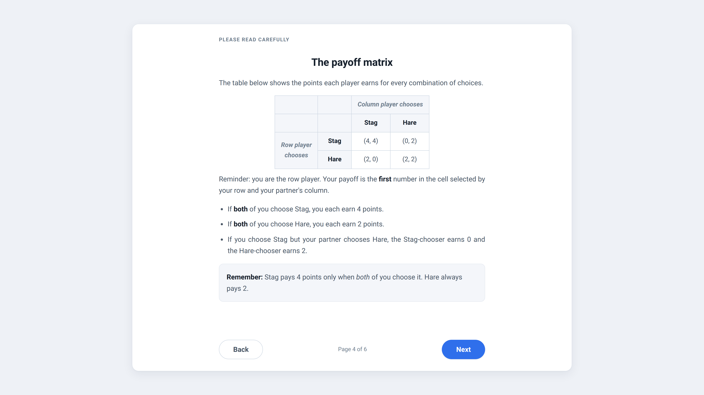
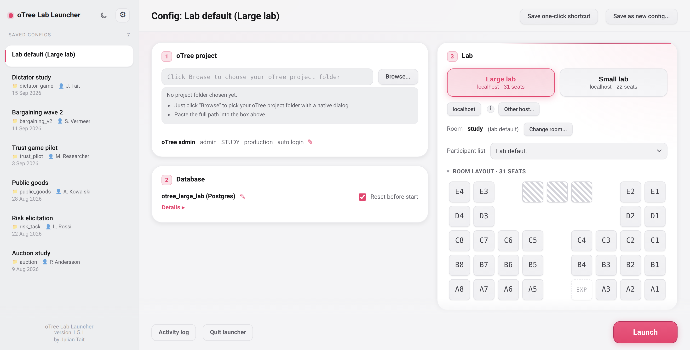
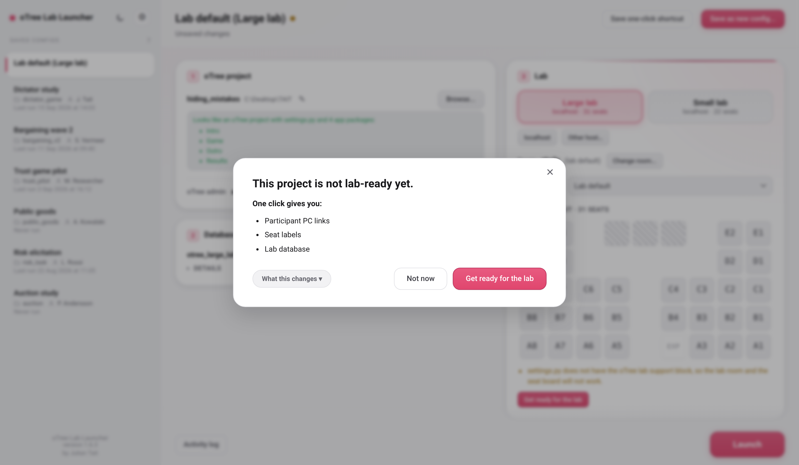
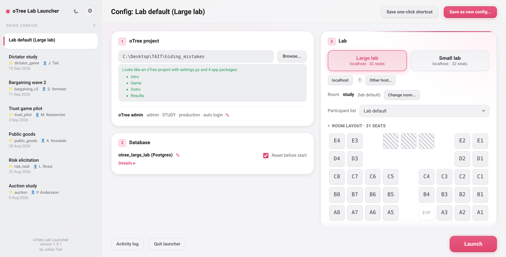
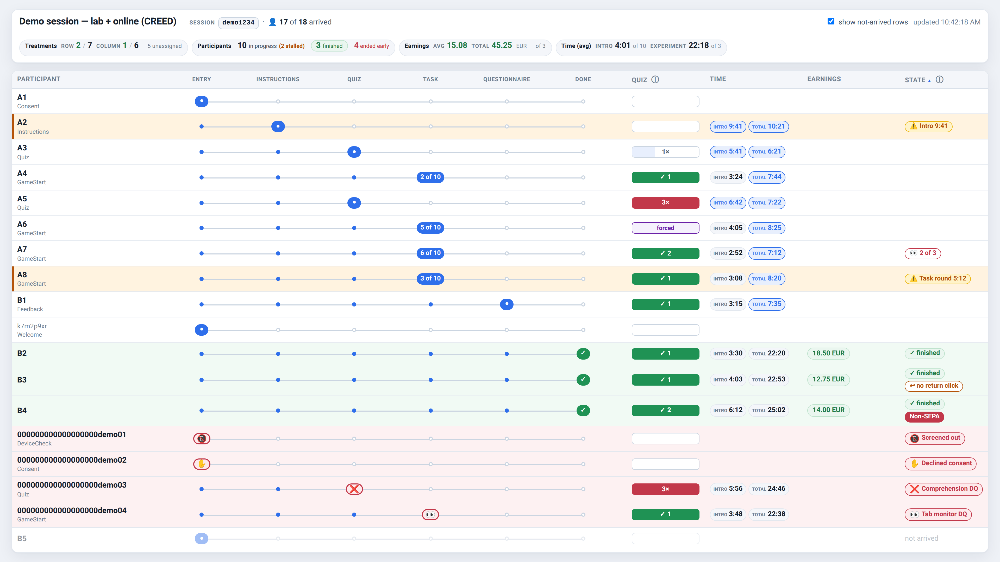

# oTree Lab Launcher: user guide

## 1. Introduction

The oTree Lab Launcher takes a working oTree experiment and makes it run in your
lab in a few clicks. You point it at your project folder and it wires up the
database, the per-seat participant links, and the experiment room, then starts
the oTree server ready for participants to sit down and begin.

It runs as a desktop app that opens in your default browser (there is also a
simple native-window version). Two people use it: a **lab manager** who sets the
machine up once, and **experimenters** who then launch their own studies without
touching any of that setup.

## 2. Usage

### Part 1 — Lab manager (one-time setup)

The lab manager looks after the machine that runs sessions. This is a one-time
job. Once it is done, experimenters never repeat any of it: they open the
launcher, point it at their project, and launch.

**Your settings: three files in `data/`.** Everything the launcher saves lives in
the `data/` folder next to the app, and nothing in it is part of the app, so an
update never touches it:

- **`lab_info.json` - the lab.** The labs (name, host address, seat list, room
  map, default room, participant-shortcut label, a suggested database name),
  the room maps themselves, the default oTree admin login for new configs, and
  the lab-wide settings (GitHub Organisation Sync, "Databases on this computer
  only"). **This is the one file you copy to every computer of the lab.** It
  holds no database passwords.
- **`machine.json` - this computer only.** Which lab this computer is, which
  labs it shows, the light/dark theme, the Postgres superuser login, and this
  computer's databases with their passwords. Never copy it to another computer.
- **`saved_configs.json` - this computer's saved configs.** Each config points at
  one of this computer's databases by name (id) and keeps its own oTree admin
  login.

**The setup wizard (once per computer).** When a computer has no lab yet, the
launcher opens a **setup wizard** with four steps:

1. **Lab: which lab is this computer?** Pick it from the labs in
   `lab_info.json`. On the very first computer (no labs yet) you add the labs
   here instead: a name, the host address of the machine that runs sessions and
   the seat list (or **Use example values**).
2. **Postgres on this computer.** The Postgres superuser and its password (the
   host is always this computer), then **Test connection**. **The password may
   be left blank** if this Postgres user has none (e.g. Postgres.app on a Mac, or
   a trust login). You may **Skip** this: without a Postgres login no database
   can be created, and launches use oTree's own SQLite until you add a Postgres
   login in Lab Settings.
3. **Databases.** The default database is pre-filled with the lab's suggested
   name; keep it or change it, then **Create** it (or **Link** one that already
   exists). **By default it uses the Postgres login from step 2** (no separate
   database user or password to set); tick **Advanced: a dedicated database
   user** to give it a user of its own. **+ Add another database** adds more.
   You may skip this too.
4. **Save.** The wizard creates the databases and saves this computer's setup.

**To set up the next computer of the same lab: copy only `lab_info.json` into
its `data/` folder and start the launcher.** The wizard asks which lab it is and
creates that computer's own databases (with the same suggested name).

Everything the wizard set is editable later under **gear -> Lab Settings**.
Room maps are part of `lab_info.json`; the two example maps ship in
`app/assets/maps/`, whose README explains the map format.

Each database is listed by its nickname. A database on another computer also
shows a grey **on HOST:PORT**; one on this computer (`localhost`) shows nothing
extra. Which computer a database was created on, and when, is shown in its
**Edit** dialog (Lab Settings). A database on `localhost` only exists on the
computer it was made on: if a database shows a warning that it was created on
another computer,
`localhost` on this one is a different Postgres, and a database of the same name
here is not the same data.

**Upgrading from 1.4 or older.** The first start of 1.5.0 converts the old
settings files (`presets.json`, `lab.local`, `ui_prefs.json`, the old
`lab_info.json`, `maps/`) into the three files above, once, and shows a short
banner. The old files are moved to `data/retired/` (with a README.txt); they are
safe to delete once the launcher works, and copying them back is how you would
return to an older version.

**What depends on the setup: three tiers**

Which features are available to experimenters depends on how far the lab manager
takes the setup.

1. **SQLite — always works, zero setup.** oTree's built-in SQLite database needs
   no configuration at all. It is the option that always works out of the box,
   and the whole session runs on the local machine. Any experimenter can use it
   with nothing set up by the lab manager. In the app it is the
   **"No lab database (oTree SQLite)"** option. If you do nothing else, this
   still works.

2. **Postgres — for a shared or custom database.** To give this computer a
   default database that every experimenter gets in one click, and/or to let
   experimenters use their own Postgres databases, the lab manager must install
   PostgreSQL on the computer and enter the **Postgres superuser and password**
   in the setup wizard (or later in Lab Settings). With that done, the wizard
   creates the default database, and the in-app buttons let anyone create their
   own database later, so you do not have to make one per study.
   (Creating a database from the app also needs `psycopg2`:
   `pip install psycopg2-binary`.)
   **Postgres passwords may be left blank.** Every Postgres password field (the
   superuser in the wizard and in Lab Settings, a database's own user) can stay
   empty when that Postgres user has no password, as on Postgres.app on a Mac or
   with a trust login. The launcher then connects with no password at all, and
   the database address it gives oTree has no password part
   (`postgres://user@host:5432/name`).
   **A database's user is optional.** In **Create a new database** (and when
   registering one that already exists), **leave New user blank** and the
   database is owned by, and connects as, **this computer's Postgres admin
   login** (the one in Lab Settings); the password field is hidden then and a
   grey note says *Uses the Postgres admin login from this computer.* The
   database remembers only *that* it uses the admin login, not a copy of it, so
   changing the admin login in Lab Settings changes it for these databases too.
   If no admin login is stored, such a database cannot be used, and Lab Settings
   and the launch check say so. **Fill in New user** to give the database its
   own role, with its own password. A blank password there only works if this
   Postgres lets users in without a password (e.g. Postgres.app); **on a
   standard Windows install, set one.** Right after creating or registering a
   database the launcher tries to log in with it; if Postgres refuses a user
   with no password, the database is kept and a warning tells you to **set a
   password (Edit database)**.
   **Databases stay on this computer by default.** Settings -> Databases on this computer
   has a lab setting, **"Databases on this computer only (localhost)"**, which is
   **on** for new and existing installs: every database Host is `localhost`, with
   no pen to change it. It is saved in `lab_info.json`, so it applies to the
   whole lab. (The databases themselves are per computer, in `machine.json`.)
   **To use a database on another computer, untick that box first.** It can then
   be added, but only registered, not created. In the add-database dialog the
   **Host** shows `localhost` greyed out; **click the pen at the end of the box**
   to type another IP or hostname (the Port unlocks with it). As soon as the host
   is not this computer, **"The database already exists in Postgres"** is ticked
   and locked: the database must already exist there, and launches then connect
   to that host. Switching back to `localhost` brings the create option back.
   A database on another computer is always shown with its address in grey
   (e.g. *on 192.0.2.10:5432*) in the database picker, on the Database card and
   on the launch confirmation screen, so it is obvious the session uses another
   computer. That computer's firewall and Postgres (`listen_addresses`,
   `pg_hba.conf`) must allow the connection; test it with a plain `psql -h`
   first.

3. **GitHub workspaces (Organisation Sync) — for pulling experiment folders from
   your lab's GitHub organisation.** This is optional and **off by default**. To
   let experimenters clone and update experiment repos straight from your lab's
   GitHub organisation (no terminal), the lab manager must:
   - **Create a GitHub organisation** for the lab and **set its base member
     permission to Read**, so members can clone and pull but not push. Make the
     lab's own GitHub account a member and allow fine-grained personal access
     tokens in the organisation settings.
   - **Give each shared lab PC one read-only lab token (recommended).** Using the
     lab account, create ONE fine-grained token for the organisation with
     **Contents: Read-only** on **All repositories**, and store it once on each
     lab PC: in the launcher with **Lab Settings -> GitHub Organisation Sync ->
     Use a different GitHub login or token** (username = the lab account,
     token = the token), or as the password on a first clone in a terminal; it
     is stored in Windows Credential Manager / the macOS Keychain. It can only read the lab's code,
     belongs to the lab (not a person), and leaves no personal login on a shared
     PC. Renew it before it expires. (Simpler alternative: sign the lab account
     in on each PC. **Never** use a personal account on a shared PC.)
   - **Researchers' own computers:** sign in with their own GitHub account.

   **The full step-by-step setup is in
   [GitHub Organisation Sync: setup and use](github_org_sync.md)** (organisation
   settings, the lab token, signing in and out on Windows and macOS, publishing a study into
   the organisation, moving repos between organisations, troubleshooting).
   **The launcher never keeps a token or GitHub login itself**: git uses the
   login stored on the machine. **Use a different GitHub login or token** (in
   Lab Settings, and in the clone dialog when a clone fails) hands a username +
   token straight to that system store, and **Forget GitHub login** removes the
   stored one; neither writes anything to a launcher file or the activity log.
   The first time, with no login stored, Windows shows Git Credential Manager's
   own sign-in window (browser or token); **on a Mac the launcher cannot ask for
   a login** (git runs without a terminal), so the clone fails with a login error
   until one is stored with that dialog or `gh auth login`.

   Turn it on under **gear -> Lab Settings -> GitHub Organisation Sync**: a tick
   box shows or hides the GitHub buttons, and a field sets the organisation name
   (so the clone target is `<org>/<repo>` and is not hardcoded). Both are lab
   settings, saved with the rest of the lab setup in `data/lab_info.json` (not
   with this computer's light/dark theme, which is in `machine.json`). When it is on, experimenters get a **GitHub**
   button next to Browse (clones a named repo and auto-selects it; its folder
   picker opens in the launcher's git-ignored `local/` scratch folder) and a
   per-config **Git Pull** button (runs `git pull` in the selected study folder,
   never the launcher's own folder).

   **What the experimenter sees.** Both buttons report back in plain language,
   with the key result in bold and git's own output tucked into a collapsed
   **Git output** block (open it only when troubleshooting):

   - **Clone.** Pressing **Clone** keeps the dialog open and shows
     *Checking that `<org>/<repo>` exists…* then *Cloning…*. On success the
     dialog closes and the new folder is selected as the study folder. If
     something is wrong the dialog **stays open with the name still typed in**,
     shows the reason, and the button becomes **Retry**. Typical reasons: *No
     repository called X found in ORG, or this login has no access to it.*
     (GitHub answers the same way for a repository that does not exist and a
     private one this login cannot see, so check the spelling first; then click
     **Use a different GitHub login or token**, enter a login that has access,
     and **Retry**); a folder with that name
     already exists in the chosen parent folder; GitHub could not be reached
     (no network); GitHub did not accept this PC's login; or the organisation
     name is not set yet.
   - **Git Pull.** After every pull a result appears at the bottom of the
     project status box, one of three:
     - **Nothing new: already up to date.**
     - **Pulled N changed files.** with the date and subject of the latest
       commit that came in, and a collapsed **Changes pulled from Git** list
       showing each file as added / modified / deleted with its lines added and
       removed.
     - **Git pull failed** with the reason, for example: no network; GitHub did
       not accept this PC's login; *local changes to `app/pages.py` would be
       overwritten* (the files are named, and nothing was changed); or the
       folder is not a git repo.

     The result stays while that study folder is selected and clears when you
     choose another folder.

**The per-seat links (the important part)**

Each lab PC opens its own fixed link:

```
http://HOST:8000/room/study?participant_label=SEAT&welcome_page_ok=1
```

- `HOST` is the machine that runs the session (the one running the launcher).
- `study` is the room.
- `SEAT` is that computer's seat label.
- `welcome_page_ok=1` skips oTree 6's Welcome/Start page, so the seat auto-admits
  with no click.

**This exact URL (with `welcome_page_ok=1`) is the link to put in all lab
documentation and on the lab computers.** Without the flag, oTree 6 first shows a
Welcome page that needs a click. Set each machine's link once — as the browser
homepage or a bookmark, one seat per machine — and you never touch it again. The
link is always active; before the room session exists it shows a wait page that
advances on its own the moment the session opens. When a participant opens their
link, that seat flips from grey to green on the experimenter's monitor, which is
how the consistent links track who's who.

**Room warning.** The desktop shortcuts point at the `study` room. If a study
uses a different room, its links must point at that room instead:

```
http://HOST:8000/room/THEIRROOM?participant_label=SEAT&welcome_page_ok=1
```

The launch confirmation screen warns about this whenever the chosen room is not
`study`, and shows the correct link to use.

**Saving configs.** You can save a config per study. A saved config relaunches
that study in one click in later sessions, so common studies are always a
double-click away.

**Updating the launcher.** In Settings, click **Update?** at the bottom; when a
new version is available, **Update** runs `git pull` on the launcher folder and
then asks you to **quit and reopen the launcher** (the Simple Tk app links to
GitHub instead; run `git pull` there). Your `data/` folder (labs, configs,
databases) is never touched: git ignores it as a whole. Before 1.5.0 a few
**shipped template files** lived in `data/` (`data/README.md`,
`data/lab_info.example.json`, `data/maps/README.md`, the example maps); the
1.5.0 update removes them from there. If a changed copy of one of them is in the
way (typically after copying a whole `data/` folder from another computer), the
update puts it back to the shipped version, retries, and says so: *"Restored 2
shipped template files that had been changed locally: ..."*. If any other file
has local changes, **the update stops and lists the files**; undo those edits,
then update again. When copying lab settings between computers, copy only
`lab_info.json`.

### Part 2 — Experimenter (usage)

Three things, in order. Read the first line of each, do it, and move on. The
"if you want to change things" note is optional.

**(i) Add your experiment folder.** Two ways:

- Click **Browse** and pick your oTree project folder. (You can also paste the
  folder path directly into the path box.)
- Or click the **GitHub** button to pull the folder from your lab's GitHub
  organisation. Type the repository name, choose a parent folder, and press
  **Clone**; the dialog only closes once the clone has worked. If it says no
  repository was found, check the spelling and press **Retry**.

*Note:* the GitHub option only works if your lab manager has set up
Organisation Sync. If you do not see it, or it does not work, ask your lab
manager.

**(ii) Save or pick a config.** A config is your study's saved settings (folder,
lab, database, seats). Saving one with **Save as new config...** writes it so you
can relaunch that exact study in one click later — pick it from the config list
on the left instead of setting everything up again. You can also save a headless
one-click desktop shortcut with **Save one-click shortcut** that re-runs the
launcher straight into that config.

*If you want to change things:* adjust the fields (lab, database, seats) before
saving. Saved configs are never edited in place — change a field and use **Save
as new config...** again to keep the original safe.

**(iii) Run it.** Once your config is saved or selected, click **Launch**
(bottom-right). A **"Before you launch"** screen appears with a summary and any
issues. When everything is clear it shows **Ready to launch**; click **Launch**
again to start. The server starts and the oTree dashboard opens on its own.

*If you want to change things:* if the screen lists warnings (for example a
default database, which may be reset between sessions, or a non-`study` room), the button reads **Launch anyway**; if it
lists must-fix items, fix them first and the button re-enables.

*If the launch fails:* the screen says **Launch failed.** with a **See activity
log** button right next to it. **Click it** to open the launcher's activity log
(the running record of what the launcher did, at the bottom of the window in the
classic app and behind the **Activity log** button in the web app): it opens
scrolled to the latest lines and briefly highlighted, so the error that stopped
the launch is right there. The same button appears wherever a message says to
see the activity log.

---

## Screens

### The main window



*Configs on the left; add your project and pick lab / database / seats on the right; Launch at the bottom-right.*

### The default run path, step by step

On the default path you do not set up the lab, database, or seats yourself:
**Launch** uses the lab default setup your lab manager already configured on the
machine, so you just add your project and launch.

**Step 1 — add your experiment folder (Browse).**



*Click Browse and pick your oTree project folder (or paste its path, or use the GitHub button).*

**Step 2 — make it lab-ready (if prompted).**



*If the project is not yet lab-ready, this popup appears. Click **Get ready for the lab** and the launcher wires it up for you.*

**Step 3 — launch.**



*Once the project is recognised and ready, just click **Launch**. The server starts and the oTree dashboard opens on its own.*

The dashboard then shows the live monitor for the running session:



*Seats flip from grey to green as participants open their machine's link.*
