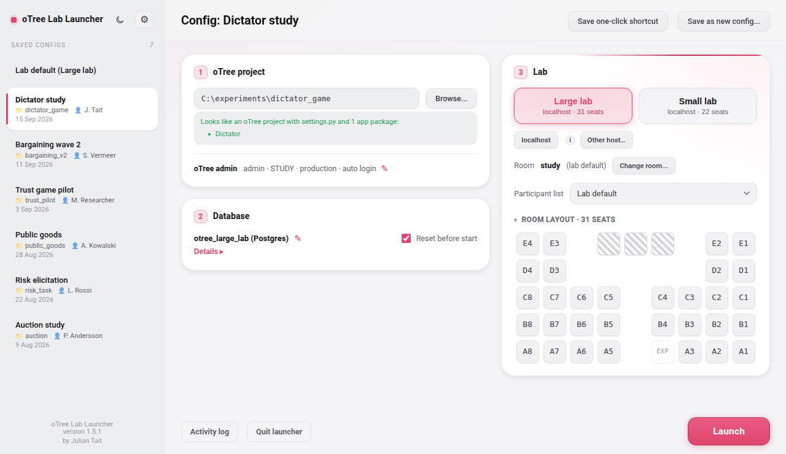

# oTree Lab Launcher: user guide

## 1. Introduction

The oTree Lab Launcher takes a working oTree experiment and makes it run in your
lab in a few clicks. You point it at your project folder and it wires up the
database, the per-seat participant links, and the experiment room, then starts
the oTree server ready for participants to sit down and begin.

It runs as a desktop app that opens in your default browser (there is also a
simple native-window version). Two people use it: a **lab manager** who sets the
machine up once, and **experimenters** who then launch their own studies without
touching any of that setup.

## 2. Usage

### Part 1 — Lab manager (one-time setup)

The lab manager looks after the machine that runs sessions. This is a one-time
job. Once it is done, experimenters never repeat any of it: they open the
launcher, point it at their project, and launch.

**Your settings: three files in `data/`.** Everything the launcher saves lives in
the `data/` folder next to the app, and nothing in it is part of the app, so an
update never touches it:

- **`lab_info.json` - the lab.** The labs (name, host address, seat list, room
  map, default room, participant-shortcut label, a suggested database name),
  the room maps themselves, the default oTree admin login for new configs, and
  the lab-wide settings (the GitHub organisation, "Databases on this computer
  only"). **This is the one file you copy to every computer of the lab.** It
  holds no database passwords.
- **`machine.json` - this computer only.** Which lab this computer is, which
  labs it shows, the light/dark theme, the Postgres superuser login, and this
  computer's databases with their passwords (plus the folder GitHub studies were
  last saved into and the GitHub login's username and token expiry date, never
  the token). Never copy it to another computer.
- **`saved_configs.json` - this computer's saved configs.** Each config points at
  one of this computer's databases by name (id) and keeps its own oTree admin
  login.

**The setup wizard (once per computer).** When a computer has no lab yet, the
launcher opens a **setup wizard** with three steps:

1. **Lab: which lab is this computer?** Pick it from the labs in
   `lab_info.json`. On the very first computer (no labs yet) you add the lab
   here instead: **a name, the host address of the machine that runs sessions
   and the seat list**, then **Next** (or **Use example values**). The default
   room, shortcut label, room map and default oTree admin login all have working
   defaults and sit under **More options**.
2. **Postgres on this computer.** The Postgres superuser (prefilled `postgres`)
   and its password, then **Next**. **Next tests the login**: if Postgres does
   not accept it, the wizard stays on this step and shows the reason, so a wrong
   password is caught here. **The password may be left blank** if this Postgres
   user has none (e.g. Postgres.app on a Mac, or a trust login). **No Postgres on
   this computer? Click Skip**: the wizard then finishes at once, because without
   a Postgres login no database can be created. Launches use oTree's own SQLite
   until you add a Postgres login in Settings.
3. **Databases.** The default database is pre-filled with the lab's suggested
   name; keep it or change it and click **Save**: the wizard creates it and saves
   this computer's setup. **It uses the Postgres login from step 2** (no separate
   database user or password to set); tick **Advanced** to give it a user of its
   own or to link a database that already exists. **+ Add another database**
   adds more. You may **Skip** this step too: the computer is then set up with
   no database.

**To set up the next computer of the same lab: copy only `lab_info.json` into
its `data/` folder and start the launcher.** The wizard asks which lab it is and
creates that computer's own databases (with the same suggested name).

Everything the wizard set is editable later under the **gear (Settings)**. Each
section there is one line (for example *Databases: otree_large_lab (default) +
2 more*) with an **Edit** button that opens it; the small **i** next to a title
or field explains it.
Room maps are part of `lab_info.json`; the two example maps ship in
`app/assets/maps/`, whose README explains the map format.

Each database is listed by its nickname. A database on another computer also
shows a grey **on HOST:PORT**; one on this computer (`localhost`) shows nothing
extra. In **Settings -> Databases**, the round button in front of a database
makes it this computer's **default** (the one the Lab default config uses), and
**Edit** / **Delete** sit on its row (Delete asks first and only removes it from
this computer's list, never from Postgres). Which computer a database was created
on, and when, is shown in its **Edit** dialog. A database on `localhost` only
exists on the computer it was made on: a database that shows **"Created on
<computer>, not this computer"** was made elsewhere, so `localhost` on this
computer is a different Postgres and a database of the same name here is not the
same data (the **i** next to the warning, and the Edit dialog, say this in
full).

**Upgrading from 1.4 or older.** The first start of 1.5.0 converts the old
settings files (`presets.json`, `lab.local`, `ui_prefs.json`, the old
`lab_info.json`, `maps/`) into the three files above, once, and shows a short
banner. The old files are moved to `data/retired/` (with a README.txt); they are
safe to delete once the launcher works, and copying them back is how you would
return to an older version.

**What depends on the setup: three tiers**

Which features are available to experimenters depends on how far the lab manager
takes the setup.

1. **SQLite — always works, zero setup.** oTree's built-in SQLite database needs
   no configuration at all. It is the option that always works out of the box,
   and the whole session runs on the local machine. Any experimenter can use it
   with nothing set up by the lab manager. In the app it is the
   **"No lab database (oTree SQLite)"** option. If you do nothing else, this
   still works.

2. **Postgres — for a shared or custom database.** To give this computer a
   default database that every experimenter gets in one click, and/or to let
   experimenters use their own Postgres databases, the lab manager must install
   PostgreSQL on the computer and enter the **Postgres superuser and password**
   in the setup wizard (or later in Settings). With that done, the wizard
   creates the default database, and the in-app buttons let anyone create their
   own database later, so you do not have to make one per study.
   (Creating a database from the app also needs `psycopg2`:
   `pip install psycopg2-binary`.)
   **Postgres passwords may be left blank.** Every Postgres password field (the
   superuser in the wizard and in Settings, a database's own user) can stay
   empty when that Postgres user has no password, as on Postgres.app on a Mac or
   with a trust login. The launcher then connects with no password at all, and
   the database address it gives oTree has no password part
   (`postgres://user@host:5432/name`).
   **A database's user is optional.** **Create a new database** asks only for
   a name and the researcher: the database is then owned by, and connects as,
   **this computer's Postgres admin login** (the one in Settings). The
   database remembers only *that* it uses the admin login, not a copy of it, so
   changing the admin login in Settings changes it for these databases too.
   If no admin login is stored, such a database cannot be used, and Settings
   and the launch check say so. Tick **Advanced** and **fill in User** to give
   the database its own role, with its own password; the same Advanced box holds
   the tick for registering a database that already exists. A blank password there only works if this
   Postgres lets users in without a password (e.g. Postgres.app); **on a
   standard Windows install, set one.** Right after creating or registering a
   database the launcher tries to log in with it; if Postgres refuses a user
   with no password, the database is kept and a warning tells you to **set a
   password (Edit database)**.
   **Databases stay on this computer by default.** Settings -> Databases
   has a lab setting, **"Databases on this computer only (localhost)"**, which is
   **on** for new and existing installs: every database Host is `localhost`, with
   no pen to change it. It is saved in `lab_info.json`, so it applies to the
   whole lab. (The databases themselves are per computer, in `machine.json`.)
   **To use a database on another computer, untick that box first.** It can then
   be added, but only registered, not created. In the add-database dialog the
   **Host** shows `localhost` greyed out; **click the pen at the end of the box**
   to type another IP or hostname (the Port unlocks with it). As soon as the host
   is not this computer, Advanced opens and **"The database already exists in
   Postgres"** is ticked and locked: the database must already exist there, and launches then connect
   to that host. Switching back to `localhost` brings the create option back.
   A database on another computer is always shown with its address in grey
   (e.g. *on 192.0.2.10:5432*) in the database picker, on the Database card and
   on the launch confirmation screen, so it is obvious the session uses another
   computer. That computer's firewall and Postgres (`listen_addresses`,
   `pg_hba.conf`) must allow the connection; test it with a plain `psql -h`
   first.

3. **GitHub — for getting experiment folders from your lab's GitHub
   organisation and keeping them up to date.** Optional and **off until an
   organisation name is typed**. The lab manager does three things, once:
   - **On GitHub:** create an organisation for the lab with base member
     permission **Read**, make the lab's own GitHub account a member, and allow
     fine-grained personal access tokens.
   - **In the launcher, on each lab PC: gear -> Settings -> GitHub -> Edit**, and
     **type the organisation name**. That is the whole setting (an empty field
     is off). It is a lab setting, saved in `data/lab_info.json`, so it travels
     with that file.
   - **Still in that section, click "GitHub login…"**, enter the lab account and
     its read-only token, and **Save**. **Create the token on GitHub** in that
     dialog opens GitHub's own form already filled in (the organisation,
     *Contents: Read-only*, the expiry): choose *All repositories*, generate,
     copy, paste. The launcher **asks GitHub once whether the token is right**:
     a wrong one is not saved (*"GitHub did not accept this token… Nothing was
     saved."*). **Never** use a personal account on a shared PC; the Settings
     line shows who is logged in, so anyone can check.

   **The full step-by-step setup is in
   [GitHub: setup and use](github_org_sync.md)** (organisation settings, the lab
   token, researchers' own computers, publishing a study into the organisation,
   moving repos between organisations, troubleshooting).
   **The launcher never keeps a token itself**: the login goes to the computer's
   own credential store (Windows Credential Manager, the macOS Keychain). The
   launcher remembers only the username and the token's **expiry date**, and
   warns from 14 days before it (*"The GitHub token on this computer expires on
   …"*). Git never asks for a login by itself, on Windows or on a Mac: the
   **GitHub login…** dialog is the one place for it, and it is offered wherever
   a login is what is missing.

   Once the organisation is set, experimenters get a **GitHub** button next to
   Browse. **What the experimenter sees**, always with the thing to do in bold
   and git's own output in a collapsed **Git output** block:

   - **Get a study.** Click **GitHub**, **pick the study from the list** (the
     organisation's repositories this computer's login can see) or type its
     name, and press **Enter**. The folder it is saved into is already filled in
     (the one used last time, else the launcher's git-ignored `local/` folder);
     **Change…** picks another. On success the dialog closes and the new folder
     is selected. If something is wrong the dialog **stays open**, says what to
     do in bold, and the button becomes **Retry**: *Check the name, or use
     another GitHub login* (GitHub answers the same way for a repository that
     does not exist and a private one this login cannot see); *Use that folder,
     or choose another folder* when the study is **already on this computer**
     (**Use that folder** selects it); *Add a GitHub login for this computer*.
     After a login is saved from here, the clone is retried by itself.
   - **Is this study up to date?** Every study folder that is a git repository
     is checked in the background when it is selected, and again when Launch is
     pressed if the last check is more than ten minutes old (**whether or not
     the GitHub organisation is set**; a `git fetch`, which only downloads what
     is new and **does not change the experiment files**). The project box then
     shows one of: **Experiment up to date · checked HH:MM**; the amber **A newer
     version of this study is available. Update?** with an **Update** button;
     ***settings.py* was changed on this computer and in the newer version.** with
     **Get a fresh copy**; **Could not check for a newer version: the login was
     not accepted.** with **GitHub login…**; or, when there is nothing to say
     (not a git repository, offline), nothing at all. It never blocks choosing a
     study or launching.
   - **Update / Git Pull.** The banner's **Update** button and the standing
     **Git Pull** button do the same thing (only one of them is on screen at a
     time): they move the folder forward to the newest version, **and never do
     anything else** (no merge, no changes to files edited on this computer).
     The result replaces the status line: **Nothing new: already up to date.**,
     or **Pulled N changed files.** with the latest commit and a collapsed
     **Changes pulled from Git** list, or **Git pull failed** with the reason
     and, right under it, the button that fixes it (**GitHub login…** or **Get a
     fresh copy**). "Get ready for the lab" does not get in the way of updates.
   - **Get a fresh copy.** When a file was edited on this computer and also in
     the newer version, the folder cannot simply be updated. The launcher never
     undoes or merges anything in a study folder; instead **Get a fresh copy**
     downloads the study again into a new folder next to the old one
     (`<name>_fresh_<date>`) and selects it. The old folder stays exactly as it
     is.

**The per-seat links (the important part)**

Each lab PC opens its own fixed link:

```
http://HOST:8000/room/study?participant_label=SEAT&welcome_page_ok=1
```

- `HOST` is the machine that runs the session (the one running the launcher).
- `study` is the room.
- `SEAT` is that computer's seat label.
- `welcome_page_ok=1` skips oTree 6's Welcome/Start page, so the seat auto-admits
  with no click.

**This exact URL (with `welcome_page_ok=1`) is the link to put in all lab
documentation and on the lab computers.** Without the flag, oTree 6 first shows a
Welcome page that needs a click. Set each machine's link once — as the browser
homepage or a bookmark, one seat per machine — and you never touch it again. The
link is always active; before the room session exists it shows a wait page that
advances on its own the moment the session opens. When a participant opens their
link, that seat flips from grey to green on the experimenter's monitor, which is
how the consistent links track who's who.

**Room warning.** The desktop shortcuts point at the `study` room. If a study
uses a different room, its links must point at that room instead:

```
http://HOST:8000/room/THEIRROOM?participant_label=SEAT&welcome_page_ok=1
```

The launch confirmation screen warns about this whenever the chosen room is not
`study`, and shows the correct link to use.

**Saving configs.** You can save a config per study. A saved config relaunches
that study in one click in later sessions, so common studies are always a
double-click away.

**Updating the launcher.** When a new version exists, **a small dot appears on
the gear** (the launcher asks GitHub at most once a day). In Settings, at the
bottom, **Update** runs `git pull` on the launcher folder and then asks you to
**quit and reopen the launcher**; **Check for updates** asks again right now.
(A launcher that was downloaded rather than cloned shows a link to GitHub
instead of the button.) Your `data/` folder (labs, configs, databases) is never
touched: git ignores it as a whole. Before 1.5.0 a few
**shipped template files** lived in `data/` (`data/README.md`,
`data/lab_info.example.json`, `data/maps/README.md`, the example maps); the
1.5.0 update removes them from there. If a changed copy of one of them is in the
way (typically after copying a whole `data/` folder from another computer), the
update puts it back to the shipped version, retries, and says so: *"Restored 2
shipped template files that had been changed locally: ..."*. If any other file
has local changes, **the update stops and lists the files**, with a button
**Discard these changes and update**: after a confirm that names the files, the
launcher keeps a copy of them in `data/retired/`, puts them back as shipped and
updates. (Everything a lab owns is in `data/` and `local/`, which an update
never touches.) When copying lab settings between computers, copy only
`lab_info.json`.

### Part 2 — Experimenter (usage)

Three things, in order. Read the first line of each, do it, and move on. The
"if you want to change things" note is optional.

**(i) Add your experiment folder.** Two ways:

- Click **Browse** and pick your oTree project folder. (You can also paste the
  folder path directly into the path box.) The launcher always opens with no
  project chosen; to come back to a study in one click, save it as a config or
  as a one-click shortcut (below).
- Or click the **GitHub** button to get the folder from your lab's GitHub
  organisation. **Pick the study from the list (or type its name) and press
  Enter**; the dialog only closes once it has worked. If the study is already on
  this computer, click **Use that folder**.

*Note:* the GitHub button is only there if your lab manager has set the lab's
GitHub organisation in Settings. If it does not work, ask your lab manager.

**(ii) Save or pick a config.** A config is your study's saved settings (folder,
lab, database, seats). Saving one with **Save as new config...** (top right)
writes it so you can relaunch that exact study in one click later — pick it from
the config list on the left instead of setting everything up again. Right next
to it, **Save one-click shortcut** saves a desktop shortcut for a saved config:
double-clicking it starts that config and opens the oTree monitor straight away,
without opening the launcher window.

**What the one-click shortcut checks first.** It has no window, so it only
stops for the things that matter:

- **A session is already running** (the port is in use): it stops, says so, and
  touches nothing.
- For exactly three other things it **asks, in one box: "Launch anyway?"** (on a
  Mac the buttons read *Launch anyway* / *Cancel*; on Windows *Yes* / *No*):
  **a newer version of the study is available** (the same quiet check as in the
  launcher; offline, not a git folder or a login problem = no question), **the
  database cannot be reached**, and **the config's room is not the lab's default
  room** (the participant computers open the lab's room). Several at once are
  listed in the same box. **Cancel** changes nothing.
- Everything else is silent.

**A config saved with the lab's default room follows the lab.** If the lab later
changes its default room, such a config simply uses the new one (in the window
and from the shortcut) and never warns about the room. A config saved with a
room of its own keeps it.

*If you want to change things:* adjust the fields (lab, database, seats) before
saving. Saved configs are never edited in place — change a field and use **Save
as new config...** again to keep the original safe.

**(iii) Run it.** Once your config is saved or selected, click **Launch**
(bottom-right). A **"Before you launch"** screen appears with a summary and any
issues. When everything is clear it shows **Ready to launch**; click **Launch**
again to start. The server starts, the screen changes to **Session running**,
and the oTree dashboard opens on its own (**Open dashboard** opens it again).
The **i** next to the lab name shows the server, the room and the per-seat link.

*If you want to change things:* if the screen lists warnings (for example a
database that cannot be reached, or no participant file chosen), the button
reads **Launch anyway**; if it lists must-fix items, fix them first and the
button re-enables.

*If a newer version of the study is available:* when the automatic check (see
the GitHub section above) found one, the screen adds the amber reminder **"A
newer version of this study is available. Update before launch."** with an
**Update** button. It warns and never blocks: update there, or launch as it is.

*If a session is already running:* the screen shows the must-fix **"Port 8000 is
in use: a session is already running on it."** and **Launch stays off**. Stop
the running session first (close its server window), then click **Re-check**.
The launcher never resets the database of a session that is still running.

*If the launch fails:* the screen says **Launch failed.** at the top, with a
**See activity log** button right next to it. **Click it** to open the launcher's activity log
(the running record of what the launcher did, at the bottom of the window in the
classic app and behind the **Activity log** button in the web app): it opens
scrolled to the latest lines and briefly highlighted, so the error that stopped
the launch is right there. The same button appears wherever a message says to
see the activity log.

---

## Screens

### The main window



*Configs on the left; add your project and pick lab / database / seats on the right; Launch at the bottom-right. Things that are set once (the oTree admin login, the database, everything in Settings) show as one line with a pen or an Edit button.*

### The default run path, step by step

On the default path you do not set up the lab, database, or seats yourself:
**Launch** uses the lab default setup your lab manager already configured on the
machine, so you just add your project and launch.

**Step 1 — add your experiment folder (Browse).**


*Click Browse and pick your oTree project folder (or paste its path, or use the GitHub button).*

**Step 2 — make it lab-ready (if prompted).**


*If the project is not yet lab-ready, this popup appears. Click **Get ready for the lab** and the launcher wires it up for you.*

**Step 3 — launch.**


*Once the project is recognised and ready, just click **Launch**. The server starts and the oTree dashboard opens on its own.*

The dashboard then shows the live monitor for the running session:


*Seats flip from grey to green as participants open their machine's link.*
